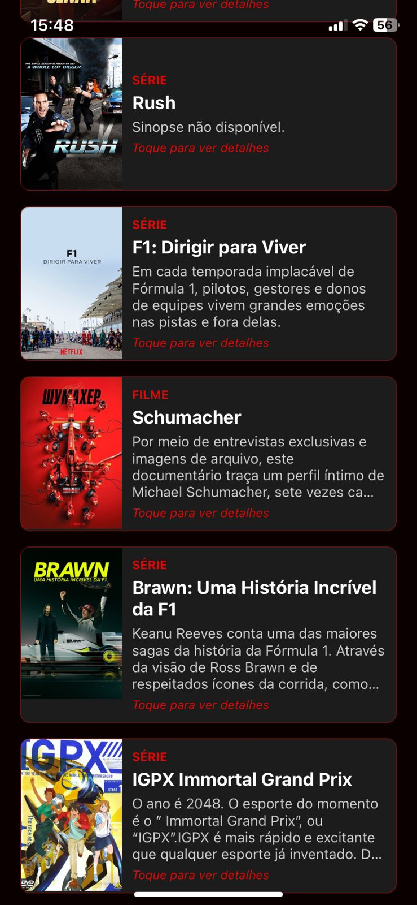
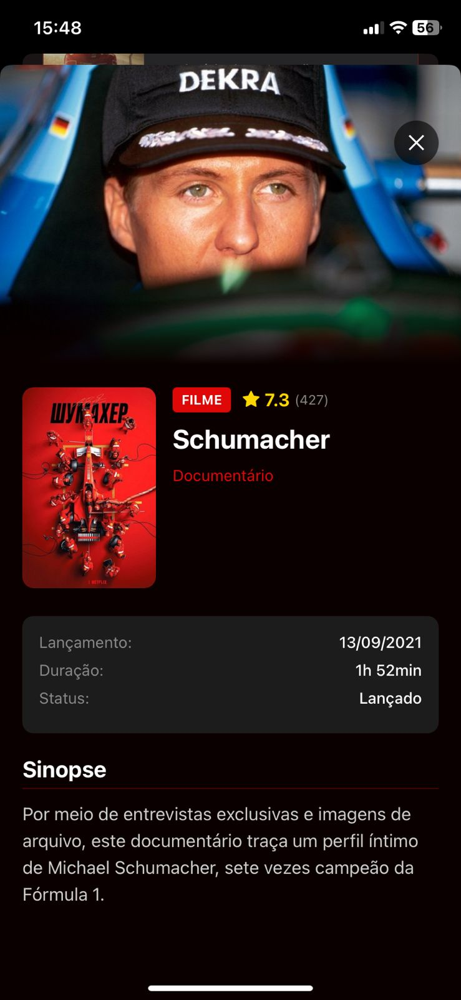

# 🎬 CineIA - Seu Assistente Inteligente de Entretenimento

<div align="center">
  
  
  [](https://reactnative.dev/)
  [](https://expo.dev/)
  [](https://www.typescriptlang.org/)
</div>

## 📱 Sobre o Projeto

O **CineIA** é um aplicativo mobile inteligente que utiliza IA para recomendar filmes e séries baseados no seu humor e preferências. Simplesmente descreva como você está se sentindo ou o que gostaria de assistir, e nossa IA encontrará as opções perfeitas para você!

### ✨ Funcionalidades

- 🤖 **Recomendações por IA**: Descreva seu humor e receba sugestões personalizadas
- 🎭 **Múltiplos Gêneros**: Filmes, séries e documentários
- 📊 **Detalhes Completos**: Sinopse, avaliações, duração e muito mais
- 🎨 **Interface Elegante**: Design moderno com tema dark
- 📱 **Experiência Nativa**: Performance otimizada para iOS e Android

## 🚀 Screenshots

<div align="center">
  
  
  
  
  
  
  
</div>

## 🛠️ Tecnologias Utilizadas

- **[React Native](https://reactnative.dev/)** - Framework mobile
- **[Expo](https://expo.dev/)** - Plataforma de desenvolvimento
- **[TypeScript](https://www.typescriptlang.org/)** - Tipagem estática
- **[Google Gemini AI](https://ai.google.dev/)** - Inteligência artificial
- **[TMDB API](https://www.themoviedb.org/documentation/api)** - Base de dados de filmes
- **[Expo Router](https://docs.expo.dev/router/introduction/)** - Navegação
- **[React Native Reanimated](https://docs.swmansion.com/react-native-reanimated/)** - Animações

## 📋 Pré-requisitos

Antes de começar, certifique-se de ter instalado:

- [Node.js](https://nodejs.org/) (versão 18 ou superior)
- [npm](https://www.npmjs.com/) ou [yarn](https://yarnpkg.com/)
- [Expo CLI](https://docs.expo.dev/get-started/installation/)
- [Expo Go](https://expo.dev/client) no seu dispositivo móvel

## 🔑 Configuração de APIs

O CineIA utiliza duas APIs essenciais que requerem chaves de acesso:

### 1. Google Gemini AI API

A API do Google Gemini é responsável por processar suas descrições de humor e preferências, gerando recomendações inteligentes e personalizadas.

**Como obter:**

1. Acesse [Google AI Studio](https://aistudio.google.com/)
2. Faça login com sua conta Google
3. Clique em "Get API Key"
4. Crie um novo projeto ou selecione um existente
5. Copie sua chave API

### 2. TMDB (The Movie Database) API

A TMDB fornece todas as informações sobre filmes e séries: sinopses, imagens, avaliações, elenco e muito mais.

**Como obter:**

1. Acesse [TMDB](https://www.themoviedb.org/)
2. Crie uma conta gratuita
3. Vá para [Configurações da API](https://www.themoviedb.org/settings/api)
4. Clique em "Create" para solicitar uma chave API
5. Preencha o formulário (pode usar fins educacionais)
6. Copie sua "API Read Access Token"

## ⚙️ Instalação e Configuração

### 1. Clone o repositório

```
git clone https://github.com/rafaelkaram/cine-ia.git
cd cine-ia
```

### 2. Instale as dependências

```
npm install
# ou
yarn install
```

### 3. Configure as variáveis de ambiente

```
# Google Gemini AI API
EXPO_PUBLIC_GEMINI_API_KEY=sua_chave_gemini_aqui

# TMDB API
EXPO_PUBLIC_TMDB_API_KEY=sua_chave_tmdb_aqui
```

### 4. Execute o projeto

```
npx expo start
```

### 5. Abra no seu dispositivo

- Escaneie o QR code com o Expo Go (Android) ou com a câmera (iOS)
- Ou pressione a para Android Emulator ou i para iOS Simulator
